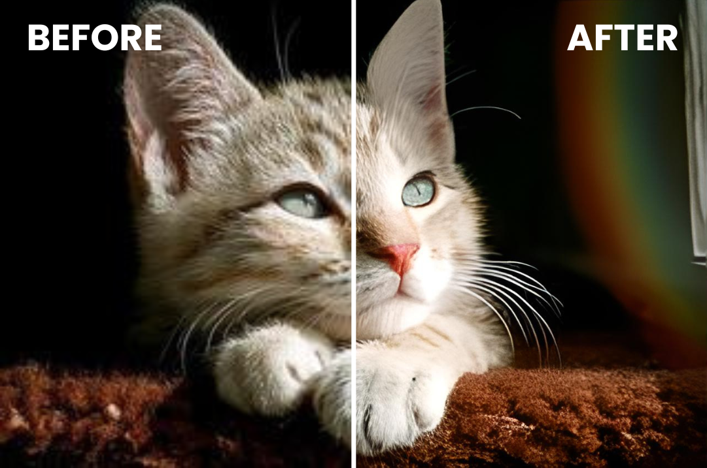

<a id="readme-top"></a>

<div align="center">
  <a href="https://github.com/aditsuru-git/ChromaScale">
    
  </a>
  <h3 align="center">ChromaScale</h3>
  <p align="center">
    A zero-effort, AI-powered image upscaler for Ubuntu.
    <br />
    <br />
    <a href="https://github.com/aditsuru-git/ChromaScale/issues/new?template=bug_report.yml">Report a Bug</a>
    ·
    <a href="https://github.com/aditsuru-git/ChromaScale/issues/new?template=feature_request.yml">Request a Feature</a>
  </p>
</div>

<div align="center">

[![Contributors][contributors-shield]][contributors-url]
[![Forks][forks-shield]][forks-url]
[![Stargazers][stars-shield]][stars-url]
[![Issues][issues-shield]][issues-url]
[![License][license-shield]][license-url]
[![Release][release-shield]][release-url]
[![Last Commit][last-commit-shield]][last-commit-url]

</div>

<details>
  <summary>Table of Contents</summary>
  <ol>
    <li><a href="#-about-the-project">About The Project</a></li>
    <li><a href="#-built-with">Built With</a></li>
    <li><a href="#-getting-started">Getting Started</a></li>
    <li><a href="#-usage">Usage</a></li>
    <li><a href="#-roadmap">Roadmap</a></li>
    <li><a href="#-contributing">Contributing</a></li>
    <li><a href="#-license">License</a></li>
    <li><a href="#-acknowledgments">Acknowledgments</a></li>
  </ol>
</details>

## 🎯 About The Project

> [!CAUTION]
> ChromaScale is in a beta version. Please be cautious while using the application and setting it up. If you find any bugs, please report them!

<div align="center">
  
</div>

ChromaScale is an automated image upscaling service for Ubuntu that runs quietly in the background. Simply drop your low-resolution images into a target folder, and ChromaScale uses a powerful AI model to enhance them and save to the configured output directory — no manual intervention required.

<div align="center">
  
</div>

**Core Features:**

- **✨ Fully Automated:** Runs as a background service, starts on boot, and automatically restarts on crash.
- **🖼️ High-Quality Upscaling:** Uses the Real-ESRGAN model to deliver 4x upscaling while handling noise and artifacts.
- **⚡ Queue-Based Processing:** Handles multiple images arriving simultaneously without missing any.
- **🔧 Configurable:** Input/output folders and “replace-file” mode can be set with a simple CLI tool.
- **💻 GPU Accelerated:** Automatically uses your NVIDIA GPU if available; falls back to CPU otherwise.

### 🛠️ Built With

[![Python-badge][Python-badge]][Python-url]
[![PyTorch-badge][PyTorch-badge]][PyTorch-url]

## 🚀 Getting Started

Follow these steps to get ChromaScale running on your Ubuntu system.

### Prerequisites

- An Ubuntu-based Linux distribution with `systemd`.
- Python 3.10+
- `uv` and `curl` package managers.
- Optional: An NVIDIA GPU with CUDA drivers for faster processing.

To install `uv`, run the following command:

```sh
curl -LsSf https://astral.sh/uv/install.sh | sh
```

### Installation

1.  Clone the repository and navigate into the directory:

    ```sh
    git clone https://github.com/aditsuru-git/ChromaScale.git
    cd ChromaScale
    ```

2.  Make the setup script executable:

    ```sh
    chmod +x setup.sh
    ```

3.  Run the setup script:
    ```sh
    ./setup.sh
    ```
    This script handles everything for you:
    - Copies all application files to a safe location (`~/.chromascale_home`).
    - Downloads the AI model weights.
    - Creates an isolated Python virtual environment.
    - Installs all necessary dependencies.
    - Sets up and enables a `systemd` background service.
    - Installs the global `chromascale` command-line tool.

The service will start automatically once the setup is complete.

## 💡 Usage

ChromaScale is designed to run in the background with zero effort. You can manage and configure the service using the simple `chromascale` CLI.

#### **Quick Start Example**

First, tell ChromaScale which folders to use.

```sh
# Create your input and output folders
mkdir -p ~/Pictures/To-Upscale
mkdir -p ~/Pictures/Upscaled-Images

# Configure the service to use these folders
chromascale set --input ~/Pictures/To-Upscale --output ~/Pictures/Upscaled-Images

# Restart the service to apply the new settings
chromascale restart
```

Now, any image you drop into `~/Pictures/To-Upscale` will be automatically processed and saved in `~/Pictures/Upscaled-Images`.

---

#### **All Available Commands**

**Service Management:**

- Check if the service is running:
  ```sh
  chromascale status
  ```
- Stop the background service:
  ```sh
  chromascale stop
  ```
- Start the background service:
  ```sh
  chromascale start
  ```
- Restart the service (required after changing settings):
  ```sh
  chromascale restart
  ```

**Logging & Debugging:**

- View the high-level application log (`Job accepted`, `Job finished`, etc.):
  ```sh
  chromascale app-logs
  ```
- View the low-level systemd service logs (for startup/crash issues):
  ```sh
  chromascale service-logs
  ```

**Configuration & Diagnostics:**

- Check if an NVIDIA GPU is detected:
  ```sh
  chromascale check-gpu
  ```
- Configure the input/output folders or change the file replacement mode:

  ```sh
  # Set the folder to watch for new images
  chromascale set --input /path/to/your/input_folder

  # Set the folder to save finished images
  chromascale set --output /path/to/your/output_folder

  # Enable in-place replacement (overwrites original files)
  chromascale set --replace

  # Disable in-place replacement (saves to output folder)
  chromascale set --no-replace
  ```

  > **Note:** The `output` directory is ignored when `--replace` mode is active.

## 🗺️ Roadmap

- [x] Core background service with Real-ESRGAN
- [x] Queue-based image processing
- [x] Command-line interface for service management
- [ ] Support for additional upscaling models (e.g., anime)
- [ ] Optional GUI for configuration and monitoring

See open [issues](https://github.com/aditsuru-git/ChromaScale/issues) for a full list of proposed features.

## 🤝 Contributing

Contributions are welcome! Please read our **[Contribution Guide](CONTRIBUTING.md)** for details on how to submit pull requests and follow the code of conduct.

## 📜 License

Distributed under the MIT License. See `LICENSE` for details.

> [!IMPORTANT]
> This app uses the Real-ESRGAN model (BSD 3-Clause License, Copyright (c) 2021, Xintao Wang).
> Redistribution and use of the model are subject to the BSD 3-Clause terms.

## 🙏 Acknowledgments

- [Real-ESRGAN](https://github.com/xinntao/Real-ESRGAN) for the AI upscaling model.
- [Watchdog](https://pypi.org/project/watchdog/) for robust folder monitoring.
- [Astral](https://astral.sh/) for `uv` package management.

<p align="right">(<a href="#readme-top">back to top</a>)</p>

<!-- MARKDOWN LINKS & IMAGES -->

[contributors-shield]: https://img.shields.io/github/contributors/aditsuru-git/ChromaScale
[contributors-url]: https://github.com/aditsuru-git/ChromaScale/graphs/contributors
[forks-shield]: https://img.shields.io/github/forks/aditsuru-git/ChromaScale
[forks-url]: https://github.com/aditsuru-git/ChromaScale/network/members
[stars-shield]: https://img.shields.io/github/stars/aditsuru-git/ChromaScale
[stars-url]: https://github.com/aditsuru-git/ChromaScale/stargazers
[issues-shield]: https://img.shields.io/github/issues/aditsuru-git/ChromaScale
[issues-url]: https://github.com/aditsuru-git/ChromaScale/issues
[license-shield]: https://img.shields.io/github/license/aditsuru-git/ChromaScale
[license-url]: https://github.com/aditsuru-git/ChromaScale/blob/main/LICENSE
[release-shield]: https://img.shields.io/github/v/release/aditsuru-git/ChromaScale?include_prereleases
[release-url]: https://github.com/aditsuru-git/ChromaScale/releases
[last-commit-shield]: https://img.shields.io/github/last-commit/aditsuru-git/ChromaScale
[last-commit-url]: https://github.com/aditsuru-git/ChromaScale/commits/main
[Python-badge]: https://img.shields.io/badge/Python-3776AB?style=for-the-badge&logo=python&logoColor=white
[Python-url]: https://www.python.org/
[PyTorch-badge]: https://img.shields.io/badge/PyTorch-EE4C2C?style=for-the-badge&logo=pytorch&logoColor=white
[PyTorch-url]: https://pytorch.org/
